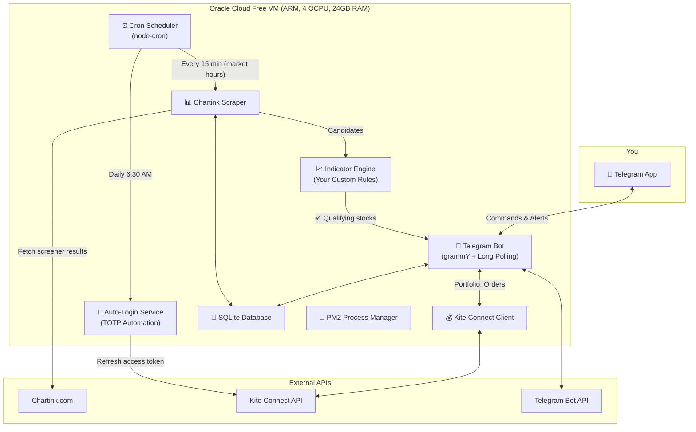
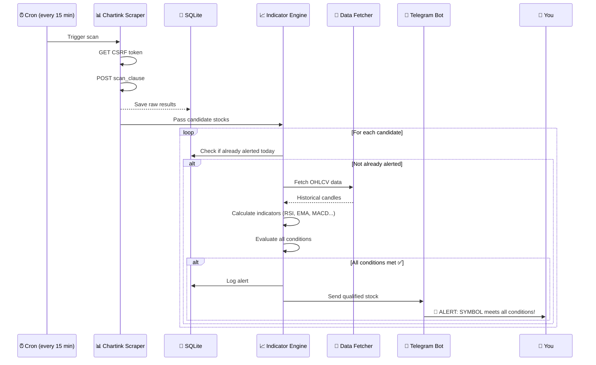

# Indian Equity Trading Assistant — Telegram Bot

A personal Telegram bot that scans Chartink screeners, validates stocks against your TradingView indicator conditions, tracks your Kite portfolio, and sends you actionable alerts — all running 24/7 for free.

## Architecture Overview



---

## User Review Required

> [!IMPORTANT]
> **Kite Connect requires a static IP for order placement.** Oracle Cloud Free Tier VMs get a static public IP, which satisfies this requirement. However, you'll need to register this IP in the Kite Connect developer portal.

> [!WARNING]
> **Kite Connect daily authentication cannot be fully "hands-free" on day 1.** The automated TOTP login uses browser automation (Puppeteer) to simulate the login flow. This works reliably but can break if Zerodha changes their login page. A fallback notification will alert you to manually re-authenticate via a link if auto-login fails.

> [!IMPORTANT]
> **Your indicator rules need to be codified.** You'll need to translate your TradingView indicator conditions into JavaScript logic. I'll create a clean, configurable rule engine where you define conditions like `RSI < 30 AND EMA_20 > EMA_50 AND volume > 2x avg_volume`. Please share your indicator conditions so I can implement them accurately.

## Open Questions

> [!IMPORTANT]
> 1. **What are your exact indicator conditions?** Please share the specific rules your TradingView indicator checks (e.g., RSI thresholds, moving average crossovers, volume conditions, candlestick patterns, etc.). I need these to build the rule engine.

> [!IMPORTANT]
> 2. **Can you share your Chartink screener URLs?** I need to see the structure of at least one screener URL to understand the `scan_clause` format and what data fields are returned.

> [!IMPORTANT]
> 3. **Do you want the bot to place orders automatically, or just recommend?** The bot can either:
>    - **(A) Alert only**: Send you a message like "RELIANCE meets all conditions — consider buying" with a button to view details
>    - **(B) Confirm & execute**: Send alert + inline "Place Order" button that places the order via Kite after your confirmation
>    - **(C) Fully automatic**: Place orders without your confirmation (high risk)

> [!NOTE]
> 4. **Do you have a Chartink premium account?** Chartink offers webhooks for premium users which would be more reliable than scraping. If not, scraping works fine for personal use.

> [!NOTE]
> 5. **What timeframes does your indicator use?** (Daily candles? 15-minute candles? etc.) This determines how frequently we need to scan and what data we need from Chartink or alternative data sources.

---

## Proposed Changes

The project will be a Node.js application organized as follows:

```
equity-bot/
├── package.json
├── .env.example
├── ecosystem.config.js          # PM2 configuration
├── src/
│   ├── index.js                 # Entry point — boots bot + cron
│   ├── config.js                # Env vars, constants, market hours
│   │
│   ├── bot/
│   │   ├── bot.js               # grammY bot setup, middleware
│   │   ├── commands/
│   │   │   ├── start.js         # /start — welcome message
│   │   │   ├── portfolio.js     # /portfolio — show holdings & P&L
│   │   │   ├── positions.js     # /positions — show open positions
│   │   │   ├── scan.js          # /scan — trigger manual screener scan
│   │   │   ├── check.js         # /check SYMBOL — check indicator for a stock
│   │   │   ├── orders.js        # /orders — show today's orders
│   │   │   ├── watchlist.js     # /watchlist — manage watchlist
│   │   │   └── help.js          # /help — command reference
│   │   ├── callbacks/
│   │   │   └── handler.js       # Inline keyboard callback handler
│   │   └── formatters.js        # Rich HTML message formatters
│   │
│   ├── screener/
│   │   ├── chartink.js          # Chartink scraper (session + CSRF + POST)
│   │   └── parser.js            # Parse & normalize screener results
│   │
│   ├── indicator/
│   │   ├── engine.js            # Rule engine — evaluates conditions
│   │   ├── rules.js             # Your indicator rules (configurable)
│   │   └── data-fetcher.js      # Fetch OHLCV data for indicator calc
│   │
│   ├── kite/
│   │   ├── client.js            # Kite Connect API wrapper
│   │   ├── auth.js              # Auto-login + TOTP generation
│   │   └── instruments.js       # Symbol mapping (Chartink → Kite)
│   │
│   ├── scheduler/
│   │   ├── cron.js              # Cron job definitions
│   │   ├── screener-job.js      # Periodic screener scan job
│   │   └── auth-job.js          # Daily token refresh job
│   │
│   ├── db/
│   │   ├── database.js          # SQLite setup (better-sqlite3)
│   │   ├── migrations.js        # Schema migrations
│   │   └── queries.js           # Prepared queries
│   │
│   └── utils/
│       ├── logger.js            # Structured logging (pino)
│       ├── market-hours.js      # IST market hours check
│       └── error-handler.js     # Global error handling + alert
│
├── deploy/
│   ├── setup-oracle.sh          # Oracle VM setup script
│   └── nginx.conf               # Nginx config (optional)
│
└── tests/
    ├── indicator.test.js
    └── screener.test.js
```

---

### Component 1: Telegram Bot (grammY)

#### [NEW] [bot.js](file:///Users/nk_pranav/.gemini/antigravity/scratch/equity-bot/src/bot/bot.js)
- grammY bot initialization with long polling (simpler than webhooks for a single VM)
- Middleware: auth check (only respond to your Telegram user ID), error handling, logging
- Command registration and routing

#### [NEW] Command handlers (`src/bot/commands/`)
Each command returns rich HTML-formatted messages with inline keyboards:

| Command | Description | Example Output |
|---|---|---|
| `/start` | Welcome + quick status | Portfolio value, market status |
| `/portfolio` | Holdings with P&L | Table of holdings, total P&L, day change |
| `/positions` | Open positions | Intraday + delivery positions |
| `/scan` | Manual screener scan | Runs all screeners, shows qualifying stocks |
| `/check SYMBOL` | Check indicator for a stock | Shows indicator values + pass/fail |
| `/orders` | Today's order book | List of placed/executed orders |
| `/watchlist` | Manage personal watchlist | Add/remove symbols, view prices |
| `/help` | Command reference | List of all commands |

#### [NEW] [formatters.js](file:///Users/nk_pranav/.gemini/antigravity/scratch/equity-bot/src/bot/formatters.js)
Rich HTML message formatting for stock data:
```
📊 RELIANCE — Reliance Industries

Price: ₹2,845.50
Change: +45.30 (+1.62%) 🟢
Volume: 12.3M (1.8x avg)

Indicator Status: ✅ ALL CONDITIONS MET
├ RSI(14): 28.5 ✅ (< 30)
├ EMA(20) > EMA(50): ✅
├ Volume: 1.8x avg ✅ (> 1.5x)
└ MACD Signal: Bullish ✅

[🛒 Place Order] [📈 View Chart] [⭐ Watchlist]
```

---

### Component 2: Chartink Scraper

#### [NEW] [chartink.js](file:///Users/nk_pranav/.gemini/antigravity/scratch/equity-bot/src/screener/chartink.js)
- Uses `axios` with a persistent session (cookies)
- Fetches CSRF token from Chartink homepage via `GET` request
- Submits screener scan via `POST https://chartink.com/screener/process`
- Handles rate limiting with configurable delays between requests
- Returns normalized array of stock objects: `{ symbol, name, price, volume, change, ... }`

**Flow:**
```
1. GET chartink.com/screener/your-screener → extract CSRF token
2. POST chartink.com/screener/process with { scan_clause, ... }
3. Parse JSON response → normalize stock symbols
4. Map Chartink symbols to NSE trading symbols (for Kite)
```

#### [NEW] [parser.js](file:///Users/nk_pranav/.gemini/antigravity/scratch/equity-bot/src/screener/parser.js)
- Parses Chartink response HTML/JSON into structured data
- Normalizes stock symbols (removes exchange prefixes, handles special chars)
- Deduplicates results across multiple screeners

---

### Component 3: Indicator Rule Engine

#### [NEW] [engine.js](file:///Users/nk_pranav/.gemini/antigravity/scratch/equity-bot/src/indicator/engine.js)
A configurable rule engine that evaluates your indicator conditions against stock data:

```javascript
// Example rule definition (you'll customize this)
const rules = {
  name: "My TradingView Strategy",
  timeframe: "daily",
  conditions: [
    { type: "RSI", period: 14, operator: "<", value: 30 },
    { type: "EMA_CROSS", fast: 20, slow: 50, direction: "bullish" },
    { type: "VOLUME", operator: ">", multiplier: 1.5, of: "avg_20" },
    { type: "MACD", signal: "bullish_crossover" },
  ],
  // All conditions must be true for a stock to qualify
  logic: "AND"
};
```

#### [NEW] [rules.js](file:///Users/nk_pranav/.gemini/antigravity/scratch/equity-bot/src/indicator/rules.js)
- Your specific indicator conditions (to be filled in after you share them)
- Support for: RSI, EMA/SMA crossovers, MACD, volume conditions, price action, Bollinger Bands, etc.

#### [NEW] [data-fetcher.js](file:///Users/nk_pranav/.gemini/antigravity/scratch/equity-bot/src/indicator/data-fetcher.js)
- Fetches OHLCV historical data needed for indicator calculations
- **Data sources** (in priority order):
  1. Kite Connect historical data API (if on paid ₹500/mo plan)
  2. Free alternatives: Yahoo Finance API, Google Finance scraping, or NSE/BSE direct data
- Caches data in SQLite to minimize API calls
- Calculates technical indicators using the `technicalindicators` npm library

---

### Component 4: Kite Connect Integration

#### [NEW] [client.js](file:///Users/nk_pranav/.gemini/antigravity/scratch/equity-bot/src/kite/client.js)
Wrapper around the `kiteconnect` npm package:
- `getHoldings()` → portfolio with current values & P&L
- `getPositions()` → open intraday/delivery positions
- `getOrders()` → today's order book
- `getMargins()` → available funds
- `placeOrder(params)` → place order (with confirmation flow)
- Token state management (loads from DB, validates, triggers refresh)

#### [NEW] [auth.js](file:///Users/nk_pranav/.gemini/antigravity/scratch/equity-bot/src/kite/auth.js)
Automated daily login:
1. Generate TOTP using `otplib` library + your saved TOTP secret
2. Use `puppeteer` (headless Chromium) to:
   - Navigate to Kite login page
   - Submit username + password
   - Submit generated TOTP
   - Capture `request_token` from redirect URL
3. Exchange `request_token` → `access_token` via Kite API
4. Store token in SQLite with expiry timestamp
5. On failure: send Telegram alert with manual login link

**Scheduled:** Runs daily at 6:30 AM IST (before market opens at 9:15 AM)

#### [NEW] [instruments.js](file:///Users/nk_pranav/.gemini/antigravity/scratch/equity-bot/src/kite/instruments.js)
- Downloads Kite instruments master file (CSV) daily
- Maps between Chartink symbols ↔ Kite trading symbols
- Handles edge cases (e.g., "RELIANCE" vs "RELIANCE-EQ")

---

### Component 5: Scheduler

#### [NEW] [cron.js](file:///Users/nk_pranav/.gemini/antigravity/scratch/equity-bot/src/scheduler/cron.js)
Using `node-cron` to schedule:

| Schedule | Job | Description |
|---|---|---|
| `30 6 * * 1-5` | Auth refresh | Auto-login to Kite before market |
| `*/15 9-16 * * 1-5` | Screener scan | Scan Chartink every 15 min during market hours |
| `0 9 * * 1-5` | Morning briefing | Push portfolio summary + market overview |
| `30 15 * * 1-5` | EOD summary | Push day's P&L and position summary |

All times in IST. Jobs only run on weekdays (Mon-Fri). Holiday calendar can be added later.

---

### Component 6: Database (SQLite)

#### [NEW] [database.js](file:///Users/nk_pranav/.gemini/antigravity/scratch/equity-bot/src/db/database.js)

**Tables:**

| Table | Purpose |
|---|---|
| `auth_tokens` | Store Kite access tokens with expiry |
| `screener_configs` | Chartink screener URLs and scan clauses |
| `scan_results` | Historical screener results (dedup alerts) |
| `watchlist` | User's personal watchlist |
| `alert_log` | Sent alerts (avoid duplicate notifications) |
| `indicator_cache` | Cached OHLCV + indicator values |

---

### Component 7: Deployment (Oracle Cloud Free Tier)

#### [NEW] [setup-oracle.sh](file:///Users/nk_pranav/.gemini/antigravity/scratch/equity-bot/deploy/setup-oracle.sh)
Automated setup script for Oracle Cloud VM:
1. Install Node.js 20.x, PM2, Chromium (for Puppeteer)
2. Clone repository, install dependencies
3. Configure environment variables
4. Start bot with PM2, enable auto-restart
5. Set up anti-idle cron job (prevent VM reclamation)
6. Configure firewall rules

#### [NEW] [ecosystem.config.js](file:///Users/nk_pranav/.gemini/antigravity/scratch/equity-bot/ecosystem.config.js)
PM2 process configuration:
- Auto-restart on crash
- Log rotation
- Memory limit watchdog
- Environment variable management

---

## Data Flow: End-to-End Scan



---

## Tech Stack Summary

| Component | Technology | Why |
|---|---|---|
| **Runtime** | Node.js 20+ | Kite SDK is Node.js native, async I/O for API calls |
| **Bot Framework** | grammY | Modern, TypeScript-first, active maintenance, great DX |
| **Broker API** | kiteconnect (npm) | Official Zerodha SDK |
| **Database** | SQLite (better-sqlite3) | Zero-config, perfect for single-user bot |
| **Scheduler** | node-cron | Lightweight, no Redis dependency |
| **Indicators** | technicalindicators (npm) | Comprehensive TA library (RSI, EMA, MACD, etc.) |
| **Browser Automation** | Puppeteer | For Kite auto-login (TOTP flow) |
| **HTTP Client** | axios | Chartink scraping with session management |
| **Process Manager** | PM2 | Auto-restart, logs, monitoring |
| **Logging** | pino | Fast structured logging |
| **Hosting** | Oracle Cloud Free Tier | 4 OCPU ARM, 24GB RAM, static IP — $0/month |

---

## Cost Breakdown

| Item | Cost |
|---|---|
| Oracle Cloud VM (Always Free) | **$0** |
| Telegram Bot API | **$0** |
| Kite Connect (Personal tier) | **$0** (orders, portfolio, positions) |
| Chartink (free account) | **$0** (scraping) |
| Domain name (optional) | **$0** (not needed for Telegram bot) |
| **Total** | **$0/month** |

> [!NOTE]
> If you need real-time WebSocket prices or historical candle data from Kite, that's ₹500/month. We can use free alternatives (Yahoo Finance, NSE direct) for indicator calculations to keep it at $0.

---

## Verification Plan

### Automated Tests
```bash
# Unit tests for indicator engine
npm test -- --grep "indicator"

# Test Chartink scraper with a known screener
npm test -- --grep "chartink"

# Test message formatters
npm test -- --grep "formatters"

# Integration test: full scan → alert pipeline (with mock data)
npm test -- --grep "pipeline"
```

### Manual Verification
1. **Bot responds to commands**: Send `/start`, `/help`, `/portfolio` via Telegram
2. **Screener works**: Run `/scan` and verify it returns stocks from your Chartink screener
3. **Indicator engine works**: Run `/check RELIANCE` and verify indicator values match TradingView
4. **Alerts work**: Wait for a scheduled scan and verify push notifications arrive
5. **Kite auth works**: Verify daily auto-login at 6:30 AM produces a valid token
6. **24/7 uptime**: Monitor PM2 logs over 48 hours for crashes or restarts
